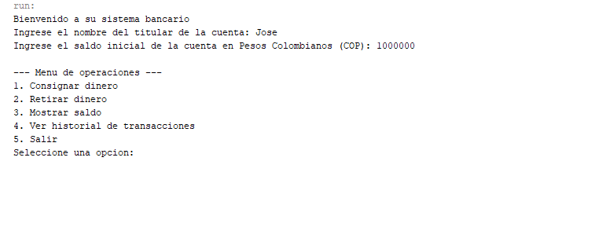

## Clases y Objetos GitHub Jeicob Murillo y Cristian Vidal

## Captura de Pantalla donde se evidencia el menú principal, tras ingresar un nombre y un monto inicial para la creación de la cuenta bancaria.

## Captura de Pantalla donde se evidencia el proceso de consignación, además de la comisión que se está cobrando por la transacción, que en este caso es de 1%.

## Captura de Pantalla donde se evidencia el proceso de retiro, donde además se agrega el impuesto de 4x1000.

## Captura de Pantalla donde se evidencia el saldo de la cuenta tras realizar las transacciones.

## Ultima captura de Pantalla donde se evidencia el historial de las transacciones realizadas, con su respectivo tipo de transacción y la fecha de realización.

## Captura donde se termina el programa con la operación número 5.

